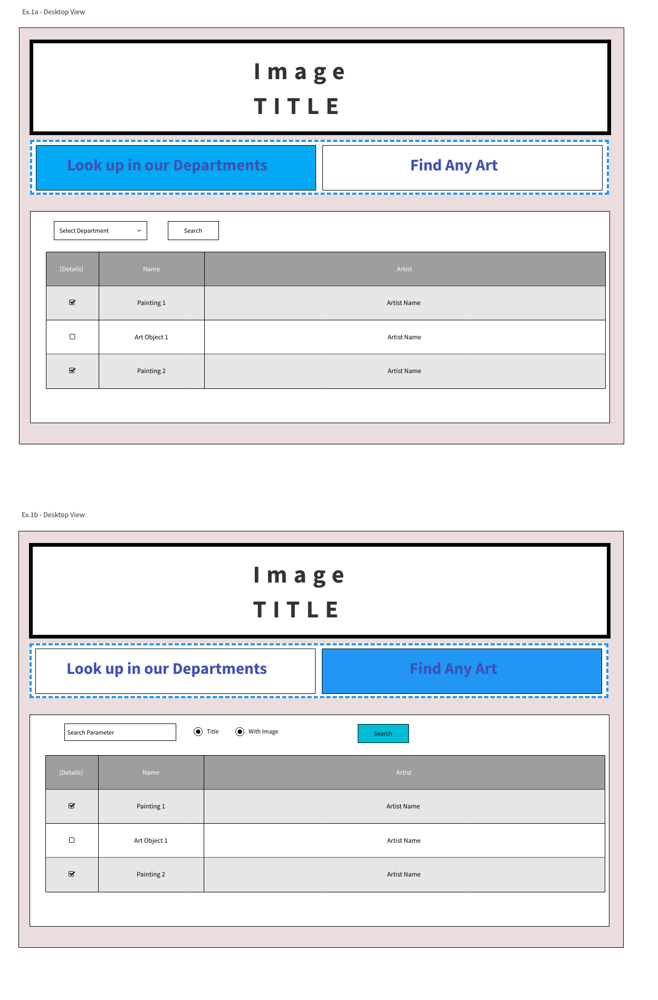
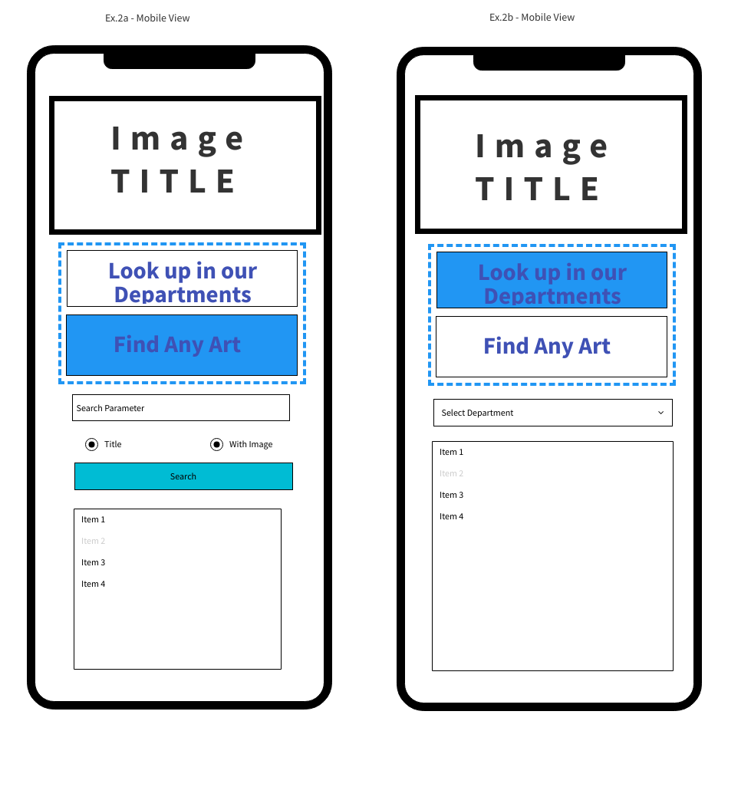

# Project

### By Yuliya Buiko

DEPLOYED SITE:

[CLICK HERE](https://sealproject1-sigma.vercel.app)

## Description on Project

a paragraph discussing the idea of your project, the API you are using and the desired user experience

> My project is about a user being able to search art available in The Met museum.

> - User can select a department and see the list of all the art work availble for each department presentrred in a form of table. Once user clicks obn the detail icon it will expand the grid item to show detailed information about the item displayed.
> - User will be able to search for art work by typing any search parameter in the search input box and observe results with detailed info about each item returned

## Details about your API

give me a brief description of the API used and how you plan to use it. Does it use some sort of authorization? List some of the URLs used below

The project makes calls to the Met Museum APIs [The Metropolitan Museum of Art Collection API](https://metmuseum.github.io/). The APIs do not require any authorization or API key. The API collection includes for endpoints:

1. GET request https://collectionapi.metmuseum.org/public/collection/v1/objects returns a listing of all valid Object IDs available to use

   - request parameters

     | Parameter     | Format                                                                                          |
     | ------------- | ----------------------------------------------------------------------------------------------- |
     | metadataDate  | datetime e.g. YYYY-MM-DD                                                                        |
     | departmentIds | integers that correspond to department IDs e.g. 1 or 3\|9\|\12, delimited with the \| character |

   - using fetch call to get ids by department:

     ```
     const url = "https://collectionapi.metmuseum.org/public/collection/v1/objects?departmentIds=1"
     fetch(url)
     .then((res) => res.json())
     .then((data) => console.log(data))
     ```

   - response with the data

     ```{
         "total": 1000, // less than the full amount of publicly-available object IDs
         "objectIDs": [
             1,
             2,
             3,
             4,
             5,
             6,
             7,
             8,
             9,
             10,
             // more results ...
         ]
     }
     ```

2. GET request https://collectionapi.metmuseum.org/public/collection/v1/objects/[objectID] returns a record for an object, containing all open access data about that object, including its image.

   - request parameters

     | Parameter | Format |
     | --------- | ------ |
     | objectID  | 0-9    |

   - using fetch call to get full object record:

     ```
     const url = "https://collectionapi.metmuseum.org/public/collection/v1/objects/437980"
     fetch(url)
     .then((res) => res.json())
     .then((data) => console.log(data))
     ```

   - response with the data

   ```
       {
           "objectID": 437980,
           "isHighlight": false,
           "accessionNumber": "49.30",
           "accessionYear": "1949",
           "isPublicDomain": true,
           "primaryImage": "https://images.metmuseum.org/CRDImages/ep/original/DP130999.jpg",
           "primaryImageSmall": "https://images.metmuseum.org/CRDImages/ep/web-large/DP130999.jpg",
           "additionalImages": [],
           "constituents": [
               {
                   "constituentID": 161947,
                   "role": "Artist",
                   "name": "Vincent van Gogh",
                   "constituentULAN_URL": "http://vocab.getty.edu/page/ulan/500115588",
                   "constituentWikidata_URL": "https://www.wikidata.org/wiki/Q5582",
                   "gender": ""
               }
           ],
           "department": "European Paintings",
           "objectName": "Painting",
           "title": "Cypresses",
           "culture": "",
           "period": "",
           "dynasty": "",
           "reign": "",
           "portfolio": "",
           "artistRole": "Artist",
           "artistPrefix": "",
           "artistDisplayName": "Vincent van Gogh",
           "artistDisplayBio": "Dutch, Zundert 1853–1890 Auvers-sur-Oise",
           "artistSuffix": "",
           "artistAlphaSort": "Gogh, Vincent van",
           "artistNationality": "Dutch",
           "artistBeginDate": "1853",
           "artistEndDate": "1890",
           "artistGender": "",
           "artistWikidata_URL": "https://www.wikidata.org/wiki/Q5582",
           "artistULAN_URL": "http://vocab.getty.edu/page/ulan/500115588",
           "objectDate": "1889",
           "objectBeginDate": 1889,
           "objectEndDate": 1889,
           "medium": "Oil on canvas",
           "dimensions": "36 3/4 x 29 1/8 in. (93.4 x 74 cm)",
           "measurements": [
               {
                   "elementName": "Overall",
                   "elementDescription": null,
                   "elementMeasurements": {
                       "Height": 93.4,
                       "Width": 74
                   }
               },
               {
                   "elementName": "Frame",
                   "elementDescription": null,
                   "elementMeasurements": {
                       "Depth": 10.795,
                       "Height": 116.2052,
                       "Width": 96.5202
                   }
               },
               {
                   "elementName": "Other",
                   "elementDescription": "glass",
                   "elementMeasurements": {
                       "Height": 94.29769,
                       "Width": 76.517654
                   }
               }
           ],
           "creditLine": "Rogers Fund, 1949",
           "geographyType": "",
           "city": "",
           "state": "",
           "county": "",
           "country": "",
           "region": "",
           "subregion": "",
           "locale": "",
           "locus": "",
           "excavation": "",
           "river": "",
           "classification": "Paintings",
           "rightsAndReproduction": "",
           "linkResource": "",
           "metadataDate": "2023-10-18T04:55:33.33Z",
           "repository": "Metropolitan Museum of Art, New York, NY",
           "objectURL": "https://www.metmuseum.org/art/collection/search/437980",
           "tags": [
               {
                   "term": "Landscapes",
                   "AAT_URL": "http://vocab.getty.edu/page/aat/300132294",
                   "Wikidata_URL": "https://www.wikidata.org/wiki/Q191163"
               },
               {
                   "term": "Cypresses",
                   "AAT_URL": "http://vocab.getty.edu/page/aat/300343641",
                   "Wikidata_URL": "https://www.wikidata.org/wiki/Q146911"
               }
           ],
           "objectWikidata_URL": "https://www.wikidata.org/wiki/Q867510",
           "isTimelineWork": true,
           "GalleryNumber": "825"
       }
   ```

3. GET /public/collection/v1/departments returns a listing of all departments.

   - no parameters

   - using fetch call to get the list of the departments:

     ```
     const url = "https://collectionapi.metmuseum.org/public/collection/v1/departments"
     fetch(url)
     .then((res) => res.json())
     .then((data) => console.log(data))
     ```

   - response with the data

     ```{
         "departments": [
             {
                 "departmentId": 1,
                 "displayName": "American Decorative Arts"
             },
             {
                 "departmentId": 3,
                 "displayName": "Ancient Near Eastern Art"
             },
             {
                 "departmentId": 4,
                 "displayName": "Arms and Armor"
             },
             {
                 "departmentId": 5,
                 "displayName": "Arts of Africa, Oceania, and the Americas"
             },
             {
                 "departmentId": 6,
                 "displayName": "Asian Art"
             },
             {
                 "departmentId": 7,
                 "displayName": "The Cloisters"
             },
             {
                 "departmentId": 8,
                 "displayName": "The Costume Institute"
             },
             {
                 "departmentId": 9,
                 "displayName": "Drawings and Prints"
             },
             {
                 "departmentId": 10,
                 "displayName": "Egyptian Art"
             },
             {
                 "departmentId": 11,
                 "displayName": "European Paintings"
             },
             {
                 "departmentId": 12,
                 "displayName": "European Sculpture and Decorative Arts"
             },
             {
                 "departmentId": 13,
                 "displayName": "Greek and Roman Art"
             },
             {
                 "departmentId": 14,
                 "displayName": "Islamic Art"
             },
             {
                 "departmentId": 15,
                 "displayName": "The Robert Lehman Collection"
             },
             {
                 "departmentId": 16,
                 "displayName": "The Libraries"
             },
             {
                 "departmentId": 17,
                 "displayName": "Medieval Art"
             },
             {
                 "departmentId": 18,
                 "displayName": "Musical Instruments"
             },
             {
                 "departmentId": 19,
                 "displayName": "Photographs"
             },
             {
                 "departmentId": 21,
                 "displayName": "Modern Art"
             }
         ]
     }
     ```

4. GET /public/collection/v1/search returns a listing of all Object IDs for objects that contain the search query within the object’s data

   - request parameters

     | Parameter | Format                                                                     | Details                                                                                                                                                                    |
     | --------- | -------------------------------------------------------------------------- | -------------------------------------------------------------------------------------------------------------------------------------------------------------------------- |
     | q         | Search term e.g. sunflowers                                                |                                                                                                                                                                            |
     | title     | Boolean, true or false. Case sensitive.                                    |                                                                                                                                                                            |
     | hasImages | Boolean, true or false. Case sensitive.                                    |                                                                                                                                                                            |
     | medium    | String, with multiple values separated by the \| operator. Case Sensitive. | Returns objects that match the query and are of the specified medium or object type. Examples include: "Ceramics", "Furniture", "Paintings", "Sculpture", "Textiles", etc. |

   - using fetch call to get the list of object ids that satisfy search parameters:

   ```
   const url = "https://collectionapi.metmuseum.org/public/collection/v1/search?q=sunflowers"
    fetch(url)
    .then((res) => res.json())
    .then((data) => console.log(data))
   ```

   - response with the data

     ```{
         "total": 93,
         "objectIDs": [
             436524,
             484935,
             437112,
             210191,
             431264,
             397949,
             656530,
             480725,
             486590,
             485308,
             375281,
             705155,
             11922,
             816522,
             343052,
             20141,
             347980,
             208554,
             ...
         ]
        }
     ```

## Mockup

The top is the image with the title of the app, followed by a navigation panel that represents search options.

Users can select the search option on the home page:

- lookup in departments:
  - user selects the department in the dropdown and the list of artwork in the department is returned on the page in the form of a grid
- find any art:
  - user can input any search parameters in the text box with options for included images or has a title and the list of artwork meeting search criteria is returned on the page in the form of a grid

Users can click on any item in the grid and see all the details about the art object: author, name, dates, materials, image, etc.

### Desktop View



### Mobile View



## Schedule of work

| Day      | Date  | Goal                                                                                                         | What I did accomplished |
| -------- | ----- | ------------------------------------------------------------------------------------------------------------ | ----------------------- |
| Saturday | 12/02 | Create ReadMe, Deploy, Get Approval                                                                          |                         |
| Sun      | 12/03 | Build fetch of data in JS file and render data returned from get by Department search                        |                         |
| Mon      | 12/04 | Render data returned from get Search by any parameter request search                                         |                         |
| Tues     | 12/05 | Build serach and dropdown form for user interaction. Build functionality to display details of a single item |                         |
| Wed      | 12/06 | wrap up functionality/ code refactoring /code clean up                                                       |                         |
| Thurs    | 12/07 | mobile layout styling                                                                                        |                         |
| Fri      | 12/08 | Desktop layout styling                                                                                       |                         |
| Sat      | 12/09 | Present Project                                                                                              |                         |
